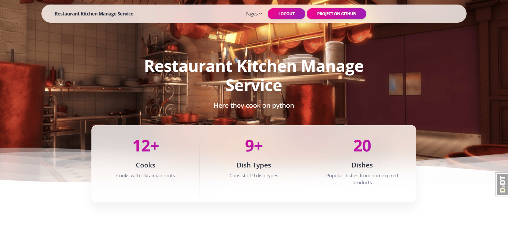

# restaurant-kitchen-service

Project for managing local restaurant.

# Demo 



## Installation

Python3 must be already installed

```shell
git clone ...
python -m venv venv
venv\Scripts\activate (on Windows)
source venv/bin/activate (on macOS)
pip install -r requirements.txt
python manage.py runserver # starts Django server
```


- Use the following command to load prepared data from fixture to see the site features:
  
`python manage.py loaddata dump.json`

- Before start server use the following command to collect static files:

`python manage.py collectstatic`

- After loading data from fixture you can use following test user (or create another one by yourself):
  - Username: `test`
  - Password: `1qazcde3`
  - 

## Features


* Authentication functionality for Cook/User
* Managing dish types, dishes & cooks directly from the website interface
* Powerful admin panel for advanced managing
